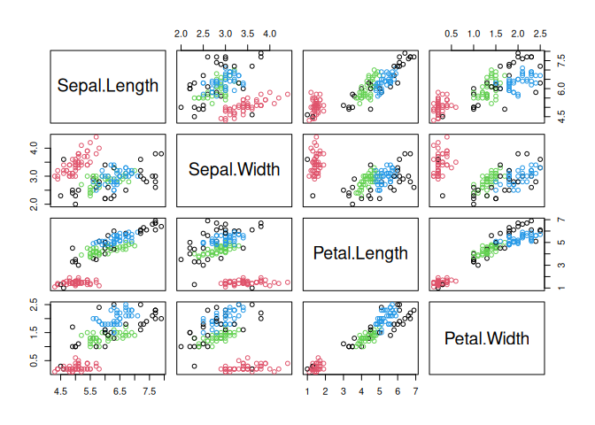
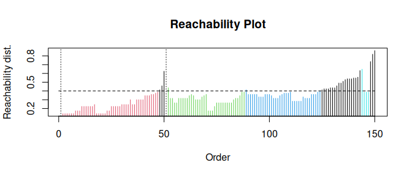
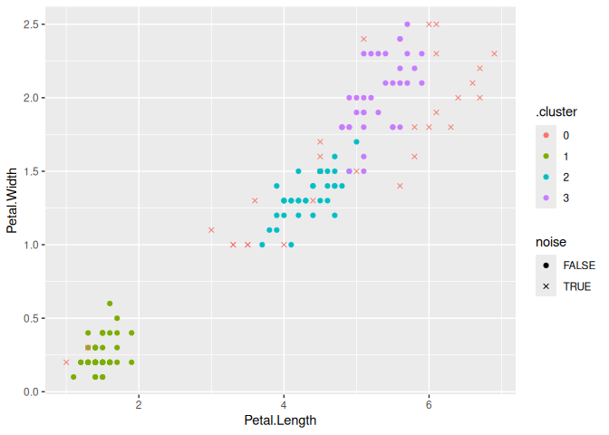

#  R package dbscan - Density-Based Spatial Clustering of Applications with Noise (DBSCAN) and Related Algorithms

[](https://mhahsler.r-universe.dev/dbscan)
[](https://CRAN.R-project.org/package=dbscan)
[](https://CRAN.R-project.org/package=dbscan)
[](https://anaconda.org/conda-forge/r-dbscan)
[](https://stackoverflow.com/questions/tagged/dbscan%2br)

## Introduction

This R package ([Hahsler, Piekenbrock, and Doran
2019](#ref-hahsler2019dbscan)) provides a fast C++ (re)implementation of
several density-based algorithms with a focus on the DBSCAN family for
clustering spatial data. The package includes:

**Clustering**

- **DBSCAN:** Density-based spatial clustering of applications with
  noise ([Ester et al. 1996](#ref-ester1996density)).
- **Jarvis-Patrick Clustering**: Clustering using a similarity measure
  based on shared near neighbors ([Jarvis and Patrick
  1973](#ref-jarvis1973)).
- **SNN Clustering**: Shared nearest neighbor clustering ([Ertöz,
  Steinbach, and Kumar 2003](#ref-erdoz2003)).
- **HDBSCAN:** Hierarchical DBSCAN with simplified hierarchy extraction
  ([Campello et al. 2015](#ref-campello2015hierarchical)).
- **FOSC:** Framework for optimal selection of clusters for unsupervised
  and semisupervised clustering of hierarchical cluster tree ([Campello,
  Moulavi, and Sander 2013](#ref-campello2013density)).
- **OPTICS/OPTICSXi:** Ordering points to identify the clustering
  structure and cluster extraction methods ([Ankerst et al.
  1999](#ref-ankerst1999optics)).

**Outlier Detection**

- **LOF:** Local outlier factor algorithm ([Breunig et al.
  2000](#ref-breunig2000lof)).
- **GLOSH:** Global-Local Outlier Score from Hierarchies algorithm
  ([Campello et al. 2015](#ref-campello2015hierarchical)).

**Cluster Evaluation**

- **DBCV:** Density-based clustering validation ([Moulavi et al.
  2014](#ref-moulavi2014)).

**Fast Nearest-Neighbor Search (using kd-trees)**

- **kNN search**
- **Fixed-radius NN search**

The implementations use the kd-tree data structure (from library ANN)
for faster k-nearest neighbor search, and are for Euclidean distance
typically faster than the native R implementations (e.g., dbscan in
package `fpc`), or the implementations in
[WEKA](https://ml.cms.waikato.ac.nz/weka/),
[ELKI](https://elki-project.github.io/) and [Python’s
scikit-learn](https://scikit-learn.org/).

The following R packages use `dbscan`:
[AFM](https://CRAN.R-project.org/package=AFM),
[AnimalSequences](https://CRAN.R-project.org/package=AnimalSequences),
[bioregion](https://CRAN.R-project.org/package=bioregion),
[CLONETv2](https://CRAN.R-project.org/package=CLONETv2),
[ClustAssess](https://CRAN.R-project.org/package=ClustAssess),
[cordillera](https://CRAN.R-project.org/package=cordillera),
[CPC](https://CRAN.R-project.org/package=CPC),
[crosshap](https://CRAN.R-project.org/package=crosshap),
[daltoolbox](https://CRAN.R-project.org/package=daltoolbox),
[DDoutlier](https://CRAN.R-project.org/package=DDoutlier),
[diceR](https://CRAN.R-project.org/package=diceR),
[dobin](https://CRAN.R-project.org/package=dobin),
[doc2vec](https://CRAN.R-project.org/package=doc2vec),
[dPCP](https://CRAN.R-project.org/package=dPCP),
[EHRtemporalVariability](https://CRAN.R-project.org/package=EHRtemporalVariability),
[eventstream](https://CRAN.R-project.org/package=eventstream),
[evprof](https://CRAN.R-project.org/package=evprof),
[fastml](https://CRAN.R-project.org/package=fastml),
[FCPS](https://CRAN.R-project.org/package=FCPS),
[fdacluster](https://CRAN.R-project.org/package=fdacluster),
[FORTLS](https://CRAN.R-project.org/package=FORTLS),
[funtimes](https://CRAN.R-project.org/package=funtimes),
[FuzzyDBScan](https://CRAN.R-project.org/package=FuzzyDBScan),
[immunaut](https://CRAN.R-project.org/package=immunaut),
[karyotapR](https://CRAN.R-project.org/package=karyotapR),
[ksharp](https://CRAN.R-project.org/package=ksharp),
[LOMAR](https://CRAN.R-project.org/package=LOMAR),
[maotai](https://CRAN.R-project.org/package=maotai),
[MapperAlgo](https://CRAN.R-project.org/package=MapperAlgo),
[metaCluster](https://CRAN.R-project.org/package=metaCluster),
[metasnf](https://CRAN.R-project.org/package=metasnf),
[mlr3cluster](https://CRAN.R-project.org/package=mlr3cluster),
[oclust](https://CRAN.R-project.org/package=oclust),
[openSkies](https://CRAN.R-project.org/package=openSkies),
[opticskxi](https://CRAN.R-project.org/package=opticskxi),
[OTclust](https://CRAN.R-project.org/package=OTclust),
[pagoda2](https://CRAN.R-project.org/package=pagoda2),
[parameters](https://CRAN.R-project.org/package=parameters),
[ParBayesianOptimization](https://CRAN.R-project.org/package=ParBayesianOptimization),
[performance](https://CRAN.R-project.org/package=performance),
[rMultiNet](https://CRAN.R-project.org/package=rMultiNet),
[seriation](https://CRAN.R-project.org/package=seriation),
[sfdep](https://CRAN.R-project.org/package=sfdep),
[sfnetworks](https://CRAN.R-project.org/package=sfnetworks),
[sharp](https://CRAN.R-project.org/package=sharp),
[shipunov](https://CRAN.R-project.org/package=shipunov),
[smotefamily](https://CRAN.R-project.org/package=smotefamily),
[snap](https://CRAN.R-project.org/package=snap),
[spdep](https://CRAN.R-project.org/package=spdep),
[spNetwork](https://CRAN.R-project.org/package=spNetwork),
[squat](https://CRAN.R-project.org/package=squat),
[ssMRCD](https://CRAN.R-project.org/package=ssMRCD),
[stream](https://CRAN.R-project.org/package=stream),
[SuperCell](https://CRAN.R-project.org/package=SuperCell),
[synr](https://CRAN.R-project.org/package=synr),
[tidySEM](https://CRAN.R-project.org/package=tidySEM),
[weird](https://CRAN.R-project.org/package=weird)

To cite package ‘dbscan’ in publications use:

> Hahsler M, Piekenbrock M, Doran D (2019). “dbscan: Fast Density-Based
> Clustering with R.” *Journal of Statistical Software*, *91*(1), 1-30.
> <doi:10.18637/jss.v091.i01> <https://doi.org/10.18637/jss.v091.i01>.

    @Article{,
      title = {{dbscan}: Fast Density-Based Clustering with {R}},
      author = {Michael Hahsler and Matthew Piekenbrock and Derek Doran},
      journal = {Journal of Statistical Software},
      year = {2019},
      volume = {91},
      number = {1},
      pages = {1--30},
      doi = {10.18637/jss.v091.i01},
    }

## Installation

**Stable CRAN version:** Install from within R with

``` r
install.packages("dbscan")
```

**Current development version:** Install from
[r-universe.](https://mhahsler.r-universe.dev/dbscan)

``` r
install.packages("dbscan",
    repos = c("https://mhahsler.r-universe.dev",
              "https://cloud.r-project.org/"))
```

## Usage

Load the package and use the numeric variables in the iris dataset

``` r
library("dbscan")

data("iris")
x <- as.matrix(iris[, 1:4])
```

DBSCAN

``` r
db <- dbscan(x, eps = 0.42, minPts = 5)
db
```

    ## DBSCAN clustering for 150 objects.
    ## Parameters: eps = 0.42, minPts = 5
    ## Using euclidean distances and borderpoints = TRUE
    ## The clustering contains 3 cluster(s) and 29 noise points.
    ## 
    ##  0  1  2  3 
    ## 29 48 37 36 
    ## 
    ## Available fields: cluster, eps, minPts, metric, borderPoints

Visualize the resulting clustering (noise points are shown in black).

``` r
pairs(x, col = db$cluster + 1L)
```

<!-- -->

OPTICS

``` r
opt <- optics(x, eps = 1, minPts = 4)
opt
```

    ## OPTICS ordering/clustering for 150 objects.
    ## Parameters: minPts = 4, eps = 1, eps_cl = NA, xi = NA
    ## Available fields: order, reachdist, coredist, predecessor, minPts, eps,
    ##                   eps_cl, xi

Extract DBSCAN-like clustering from OPTICS and create a reachability
plot (extracted DBSCAN clusters at eps_cl=.4 are colored)

``` r
opt <- extractDBSCAN(opt, eps_cl = 0.4)
plot(opt)
```

<!-- -->

HDBSCAN

``` r
hdb <- hdbscan(x, minPts = 4)
hdb
```

    ## HDBSCAN clustering for 150 objects.
    ## Parameters: minPts = 4
    ## The clustering contains 2 cluster(s) and 0 noise points.
    ## 
    ##   1   2 
    ## 100  50 
    ## 
    ## Available fields: cluster, minPts, coredist, cluster_scores,
    ##                   membership_prob, outlier_scores, hc

Visualize the hierarchical clustering as a simplified tree. HDBSCAN
finds 2 stable clusters.

``` r
plot(hdb, show_flat = TRUE)
```

<!-- -->

## Using dbscan with tidyverse

`dbscan` provides for all clustering algorithms `tidy()`, `augment()`,
and `glance()` so they can be easily used with tidyverse, ggplot2 and
[tidymodels](https://www.tidymodels.org/learn/statistics/k-means/).

``` r
library(tidyverse)
db <- x %>%
    dbscan(eps = 0.42, minPts = 5)
```

Get cluster statistics as a tibble

``` r
tidy(db)
```

    ## # A tibble: 4 × 3
    ##   cluster  size noise
    ##   <fct>   <int> <lgl>
    ## 1 0          29 TRUE 
    ## 2 1          48 FALSE
    ## 3 2          37 FALSE
    ## 4 3          36 FALSE

Visualize the clustering with ggplot2 (use an x for noise points)

``` r
augment(db, x) %>%
    ggplot(aes(x = Petal.Length, y = Petal.Width)) + geom_point(aes(color = .cluster,
    shape = noise)) + scale_shape_manual(values = c(19, 4))
```

<!-- -->

## Using dbscan from Python

R, the R package `dbscan`, and the Python package `rpy2` need to be
installed.

``` python
import pandas as pd
import numpy as np

### prepare data
iris = pd.read_csv('https://archive.ics.uci.edu/ml/machine-learning-databases/iris/iris.data', 
                   header = None, 
                   names = ['SepalLength', 'SepalWidth', 'PetalLength', 'PetalWidth', 'Species'])
iris_numeric = iris[['SepalLength', 'SepalWidth', 'PetalLength', 'PetalWidth']]

# get R dbscan package
from rpy2.robjects import packages
dbscan = packages.importr('dbscan')

# enable automatic conversion of pandas dataframes to R dataframes
from rpy2.robjects import pandas2ri
pandas2ri.activate()

db = dbscan.dbscan(iris_numeric, eps = 0.5, MinPts = 5)
print(db)
```

    ## DBSCAN clustering for 150 objects.
    ## Parameters: eps = 0.5, minPts = 5
    ## Using euclidean distances and borderpoints = TRUE
    ## The clustering contains 2 cluster(s) and 17 noise points.
    ## 
    ##  0  1  2 
    ## 17 49 84 
    ## 
    ## Available fields: cluster, eps, minPts, dist, borderPoints

``` python
# get the cluster assignment vector
labels = np.array(db.rx('cluster'))
labels
```

    ## array([[1, 1, 1, 1, 1, 1, 1, 1, 1, 1, 1, 1, 1, 1, 1, 1, 1, 1, 1, 1, 1, 1,
    ##         1, 1, 1, 1, 1, 1, 1, 1, 1, 1, 1, 1, 1, 1, 1, 1, 1, 1, 1, 0, 1, 1,
    ##         1, 1, 1, 1, 1, 1, 2, 2, 2, 2, 2, 2, 2, 0, 2, 2, 0, 2, 2, 2, 2, 2,
    ##         2, 2, 0, 2, 2, 2, 2, 2, 2, 2, 2, 2, 2, 2, 2, 2, 2, 2, 2, 2, 2, 0,
    ##         2, 2, 2, 2, 2, 0, 2, 2, 2, 2, 0, 2, 2, 2, 2, 2, 2, 0, 0, 2, 0, 0,
    ##         2, 2, 2, 2, 2, 2, 2, 0, 0, 2, 2, 2, 0, 2, 2, 2, 2, 2, 2, 2, 2, 0,
    ##         2, 2, 0, 0, 2, 2, 2, 2, 2, 2, 2, 2, 2, 2, 2, 2, 2, 2]],
    ##       dtype=int32)

## License

The dbscan package is licensed under the [GNU General Public License
(GPL) Version 3](https://www.gnu.org/licenses/gpl-3.0.en.html). The
**OPTICSXi** R implementation was directly ported from the ELKI
framework’s Java implementation (GNU AGPLv3), with permission by the
original author, Erich Schubert.

## Changes

- List of changes from
  [NEWS.md](https://github.com/mhahsler/dbscan/blob/master/NEWS.md)

## References

<div id="refs" class="references csl-bib-body hanging-indent"
entry-spacing="0">

<div id="ref-ankerst1999optics" class="csl-entry">

Ankerst, Mihael, Markus M Breunig, Hans-Peter Kriegel, and Jörg Sander.
1999. “OPTICS: Ordering Points to Identify the Clustering Structure.” In
*ACM Sigmod Record*, 28:49–60. 2. ACM.
<https://doi.org/10.1145/304181.304187>.

</div>

<div id="ref-breunig2000lof" class="csl-entry">

Breunig, Markus M, Hans-Peter Kriegel, Raymond T Ng, and Jörg Sander.
2000. “LOF: Identifying Density-Based Local Outliers.” In *ACM Int.
Conf. On Management of Data*, 29:93–104. 2. ACM.
<https://doi.org/10.1145/335191.335388>.

</div>

<div id="ref-campello2013density" class="csl-entry">

Campello, Ricardo JGB, Davoud Moulavi, and Jörg Sander. 2013.
“Density-Based Clustering Based on Hierarchical Density Estimates.” In
*Pacific-Asia Conference on Knowledge Discovery and Data Mining*,
160–72. Springer. <https://doi.org/10.1007/978-3-642-37456-2_14>.

</div>

<div id="ref-campello2015hierarchical" class="csl-entry">

Campello, Ricardo JGB, Davoud Moulavi, Arthur Zimek, and Joerg Sander.
2015. “Hierarchical Density Estimates for Data Clustering,
Visualization, and Outlier Detection.” *ACM Transactions on Knowledge
Discovery from Data (TKDD)* 10 (1): 5.
<https://doi.org/10.1145/2733381>.

</div>

<div id="ref-erdoz2003" class="csl-entry">

Ertöz, Levent, Michael Steinbach, and Vipin Kumar. 2003. “Finding
Clusters of Different Sizes, Shapes, and Densities in Noisy, High
Dimensional Data.” In *Proceedings of the 2003 SIAM International
Conference on Data Mining (SDM)*, 47–58.
<https://doi.org/10.1137/1.9781611972733.5>.

</div>

<div id="ref-ester1996density" class="csl-entry">

Ester, Martin, Hans-Peter Kriegel, Jörg Sander, Xiaowei Xu, et al. 1996.
“A Density-Based Algorithm for Discovering Clusters in Large Spatial
Databases with Noise.” In *Proceedings of 2nd International Conference
on Knowledge Discovery and Data Mining (KDD-96)*, 226–31.
<https://dl.acm.org/doi/10.5555/3001460.3001507>.

</div>

<div id="ref-hahsler2019dbscan" class="csl-entry">

Hahsler, Michael, Matthew Piekenbrock, and Derek Doran. 2019.
“<span class="nocase">dbscan</span>: Fast Density-Based Clustering with
R.” *Journal of Statistical Software* 91 (1): 1–30.
<https://doi.org/10.18637/jss.v091.i01>.

</div>

<div id="ref-jarvis1973" class="csl-entry">

Jarvis, R. A., and E. A. Patrick. 1973. “Clustering Using a Similarity
Measure Based on Shared Near Neighbors.” *IEEE Transactions on
Computers* C-22 (11): 1025–34.
<https://doi.org/10.1109/T-C.1973.223640>.

</div>

<div id="ref-moulavi2014" class="csl-entry">

Moulavi, Davoud, Pablo A. Jaskowiak, Ricardo J. G. B. Campello, Arthur
Zimek, and Jörg Sander. 2014. “Density-Based Clustering Validation.” In
*Proceedings of the 2014 SIAM International Conference on Data Mining
(SDM)*, 839–47. <https://doi.org/10.1137/1.9781611973440.96>.

</div>

</div>
